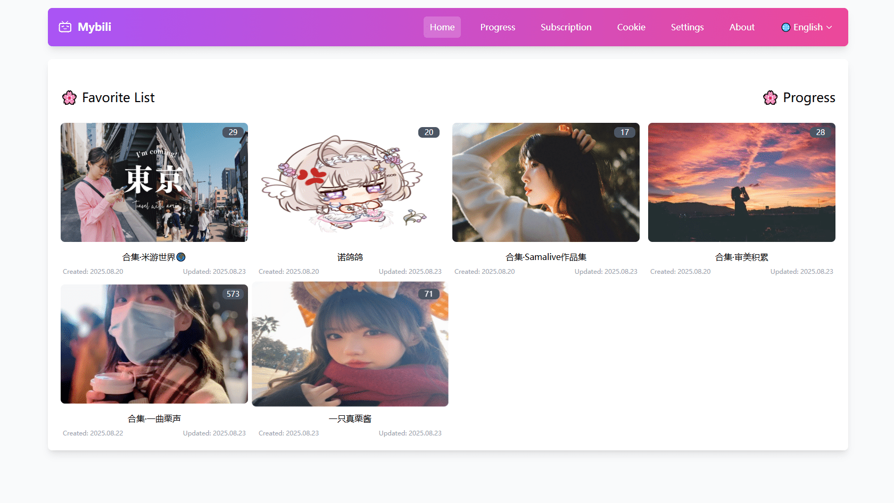

## 🎥 Mybili

**bilibili 收藏夹下载工具**

主要是解决翻看收藏夹时，很多视频莫名其妙不见了的现象，也不知道原来的视频标题和内容，进而无法溯源和寻找备份。

**该工具能够将你的收藏夹全部备份下来。**

🛠️功能如下：

- ⏰ 定时5分钟获取你的收藏夹所有视频，缓存标题、描述、封面等重要信息。
- 🚀 自动通过队列，将你收藏的视频按照最高画质下载一份到本地。
- 📺 提供友好的 web 页面展示你的收藏夹列表信息，以及进行在线播放预览。


## 预览




## 📚 使用方法

该演示以最公共简单的方式创建一个服务，让你能够快速的体验到，你可以根据实际的需求和现实修改其中配置和部署方式。

- 程序只依赖 redis 数据库来存储你的收藏夹信息

### 🐳 1.通过 docker 部署于你 nas

创建存储目录
```bash
mkdir /mnt/user/mybili/data -p
mkdir /mnt/user/mybili/redis -p
touch /mnt/user/mybili/cookie.txt
```


**复制一份 .env.example 修改 redis 配置为你自己的实际配置**，将文件存储于 /mnt/user/mybili/.env

参考主要修改内容如下：
```
APP_KEY=base64:1CJOuWliDyx0ZBIZyn0gRKOOOq6+23YG/UHcUP4ffaU=

REDIS_HOST=redis
REDIS_PASSWORD=null
REDIS_PORT=6379
REDIS_DB=3
REDIS_PREFIX=
```


创建一个 docker 服务配置

 `/mnt/user/mybili/docker-compose.yml`

 容器内部端口 80(http) 和 443(https) 都可以使用

```yml
version: '3'

services: 
    mybili:
        image: ellermister/mybili
        ports:
            - "5151:80"
        volumes:
            - "./data:/app/storage/app/public"
            - "./.env:/app/.env"
            - "./cookie.txt:/app/storage/app/cookie.txt"
    redis:
        image: redis
        volumes:
            - "./redis:/data"
        command: redis-server --save 60 1 --loglevel warning
        
```

一键启动:
```bash
docker-compose up -d
```

### 🍪 2.获取 cookie

你有两个方案可选其一

#### 方案1 - 手动

在你的浏览器安装插件

[Get cookies.txt LOCALLY](https://chrome.google.com/webstore/detail/cclelndahbckbenkjhflpdbgdldlbecc)

在你登录哔哩哔哩后，通过插件导出 cookie 文件。需要格式为：`Netscape`

访问 `http://your-ip:5151/cookie`

上传 cookie 文件，稍后将自动开始同步你的收藏夹了！🍡🍡🍡


#### 方案2 - 自动

由于方案1上传 cookie 会话之后，会在几天之后自动过期, 无法实现长期的自动同步。

原因是因为登录的网页版 bilibili 在同期使用时，重新获取了新的短期 token，而 mybili 并没有更新，也没有机制去自动获取新的 token，如果 mybili 自己去获取新的 token 也会导致你的网页版本掉线。无论是从实现复杂度还是使用体验来论都不好。

目前参考上述插件获取 cookie 内容，加以加工，制作了一个简单的自动同步 cookie chrome 扩展，只需要填写你的 mybili 网页地址。就能够实现自动无感知自动同步 cookie 到 mybili。

https://github.com/ellermister/mybili-cookie

1. 打开项目地址，点击 "Code" -> "Download ZIP" 下载项目
2. 将下载的项目解压到本地目录，长期使用请合理安排目录位置，如 `C:\mybili-cookie`
3. 打开 chrome 浏览器 `chrome://extensions/` 打开 "开发人员模式"
4. 加载解压缩的扩展 选择目录 `C:\mybili-cookie` 以开启扩展
5. 点击新安装的扩展，在弹出的 popup.html 页面里填写你的 mybili 地址，截至到端口即可, 如 `http://192.168.1.200:5151`


### 📝 3. 日志排查

在容器内部，存储了多份日志，来源于不同的服务产生的文件。
```bash
/app # ls /var/log
queue.log.0        schedule.log.0     supervisord.log.0  web.log.0
```

web
网页不通或者异常报错，可以查看 laravel 的日志
```bash
tail -f /app/storage/logs/laravel.log
```

## 💓 支持本项目

如果你喜欢这个项目，或者它对你有帮助，请考虑支持我！

### 赞助方式

你可以通过以下方式支持这个项目：

- **Buy me a coffee**: [买一杯咖啡](https://buymeacoffee.com/ellermister)

任何形式的支持都将帮助我继续改进和维护这个项目，非常感谢！